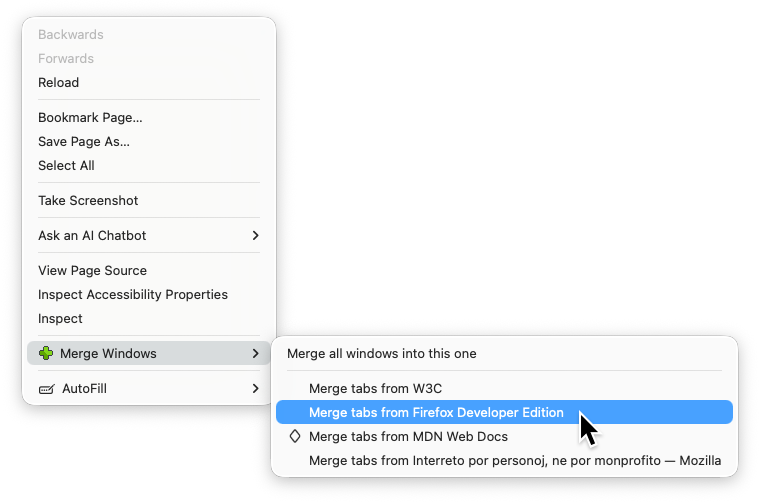
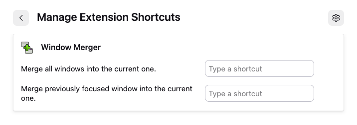
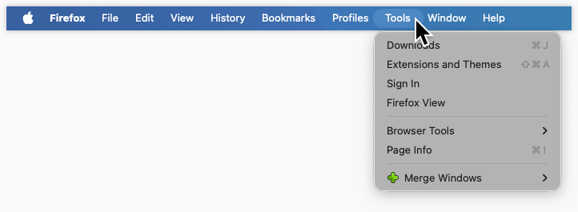
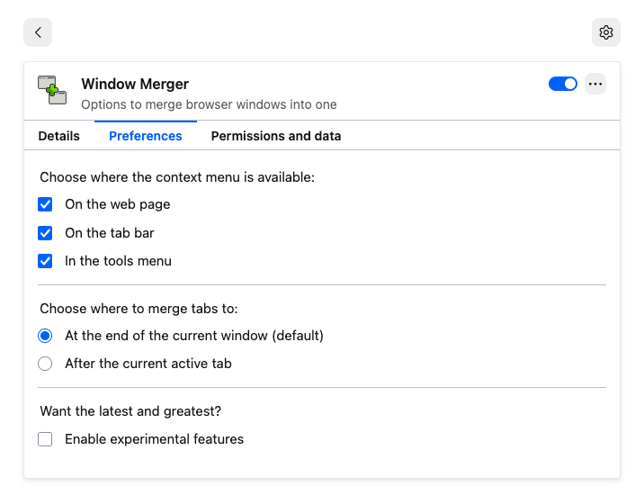
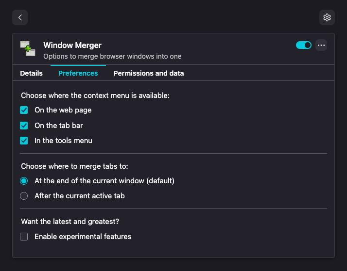

#  Window Merger

[](https://addons.mozilla.org/firefox/addon/window-merger/)

[](https://addons.mozilla.org/firefox/addon/window-merger/reviews/)
[](COPYING)

Window Merger was created to address how people want to merge browser windows
together after a long browsing session. Simply right click to open Firefox’s
context menu when multiple windows are open, pick the window you want to merge
with, and done!

It focusses on merging windows alone, but gives some usability choices that
other alternatives do not have like user defined keyboard shortcuts and
accessibility through the browser’s own Tools menu.

Have a look at the screenshots to see what is on offer!

* **Window Merger does not require you to merge everything.** Often people
  wanted to merge only specific windows together, so that choice had to
  be given.
* **Window Merger does not require you to use a mouse.** It offers configurable
  keyboard actions for those who prefer it.
* **Window Merger works together with Private Windows.** Private windows are
  kept separate from normal windows in all features. A private window will only
  ever merge with another private window, making sure tabs do not leak into
  non-private space.

Special care was taken to make sure the extension would fit well within the
browser. Its preferences screen integrates with the Extensions page really
well, and adheres to dark mode if chosen by the user. Releases are also tested
with ESR versions of Firefox to be as accessible as possible.

Beside this Window Merger tries to stick to the Linux mantra of “Do One Thing
and Do It Well”.

Some other tab management extensions you may like:

* **[Select Tabs][]** — for another add-on doing one thing well!
* **[FoxyTab][]** — for the all in one thing. If Window Merger does not satisfy
  your habits, chances are a configuration of FoxyTab exists that does!
* **[Duplicate Tabs Closer][]** — for cleaning tabs after merging windows. If
  getting rid only of windows is not enough, Duplicate Tabs Closer can help you
  to clear out tabs as well!

## Screenshots

Context menu (e.g. triggered by right clicking the page) allowing the choice of
exactly what window to merge with.



Extension shortcuts for those who want quicker access away from their mouse.



Also integrates with Firefox’s main “Tools” menu item for easy access in the
browser interface.



Extension preferences for making the menu available where you want it to be,
and for switching the merging strategy.



The same preferences tab as it shows up in Firefox’s default theme on macOS
with the operating system appearance set to “Dark”.



## Code Style

This extension follows the defaults from [Biome][]. I apologise if you like
configurations. Biome was picked because it can run without the need of any
extra files in this repository, and because it combines formatting and linting.

The codebase is checked by Biome for formatting and linting, by web-ext for
browser extension validity, and by [TypeScript][] for static type checking. All
checks can be run together after making sure dependencies are installed:

```sh
npm install
npm test
```

## Upkeep

To check for outdated dependencies, use [npm-check-updates][]:

```sh
npx npm-check-updates
```

After making changes to `package.json`, sort it with [sort-package-json][]:

```sh
npx sort-package-json
```

## Licenses

* This project uses [REUSE][] to ensure license compliance. You can use their
  tooling to inspect all the different licenses that apply to this repository.
* All code packaged into the add-on is released under the the BSD Zero Clause
  License (0BSD). Please see the [license text](LICENSES/0BSD.txt) for more
  information.
* The icons packaged into the add-on are released under the Creative Commons
  Attribution 4.0 International Public License (CC-BY-4.0). Please see the
  [license text](LICENSES/CC-BY-4.0.txt) for more information.
* A single external graphic is used by this add-on under the MIT License (MIT).
  Please see the [license text](LICENSES/LicenseRef-Tabler-MIT.txt) for more
  information.

[Select Tabs]: https://addons.mozilla.org/firefox/addon/select-tabs/
[FoxyTab]: https://addons.mozilla.org/firefox/addon/foxytab/
[Duplicate Tabs Closer]: https://addons.mozilla.org/firefox/addon/duplicate-tabs-closer/
[Biome]: https://biomejs.dev/
[TypeScript]: https://www.typescriptlang.org/
[REUSE]: https://reuse.software/
[npm-check-updates]: https://npmx.dev/npm-check-updates
[sort-package-json]: https://npmx.dev/sort-package-json
